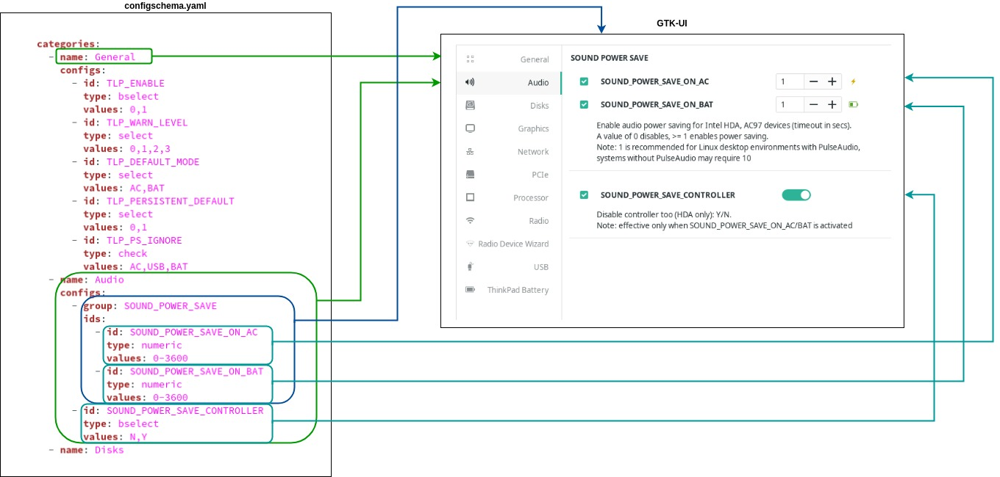

This documentation has the aim to enable future development of features and improvements for the TLP-UI project.
It consists the idea behind the UI and a description of the internal structure.

# Idea:

The idea of this projects was and is to build a graphical application which has the ability to be created on runtime for
any supported version of the TLP configuration file. Many UIs contain the weakness that they have to be rebuild 
whenever there haven been changes to the main application even though the base configuration has not changed much.

# Solution:

TLP-UI tries to solve this with a different approach. It supports an easy way to enable version updates to the UI
without touching the code itself. By creating the config objects on-the-fly, the UI has the ability to be created
for updated TLP configuration files only by providing an updated schema file. This file describes the configuration
items and it's supported values.

# Configuration schema:

The schema file contains multiple nested items. Categories contain groups of configs or configs directly. Categories are
visualized as Gtk.Viewport within a Gtk.Notebook that contains a Gtk.Box with all related config group and items.
Groups contain multiple config items that belong to each other and is translated into a Gtk.Label for better visibility.

**Categories -> Configs/Config-groups -> Configs**

Every config item contains:

## id:

The name of the config file which matches the exact value in the TLP config file.

## type:

The type of the config item which on the one hand defines the config options and on the other hand translates
to a specific Gtk config object or set of GTK objects.

### Basic config items

| type | GTK widget | Description                               |
|--|------------|-------------------------------------------|
| bselect | GTK.Switch | Activate or deactivate config state. First value is disable, second one enable |
| select | Gtk.ComboBoxText | Select box for pre defined values. Only one can be selected |
| multiselect | Gtk.ToggleButton | Multiple toggle buttons which can be selected independently |
| check | Gtk.CheckButton | Multiple check buttons which can be selected independently |
| numeric | Gtk.SpinButton | Number selection for numeric config items |
| entry | Gtk.Entry  | Free text field for too complex values or if no complex config item has been created yet |

### Complex config items

| type | Description                    |
|--|--------------------------------|
| disklist | Collection of multiple Gtk widgets that create a local disk overview |
| disklistview | Label for disklist item values |
| pcilist | Collection of multiple Gtk widgets that create a local pci device overview |
| usblist | Collection of multiple Gtk widgets that create a local usb device overview |

## values:

Values are used to define ranges or to specify available configs.

## Schema to UI transition

The image below shows how the items from the configschema.yaml files translate to UI objects in Gtk.

